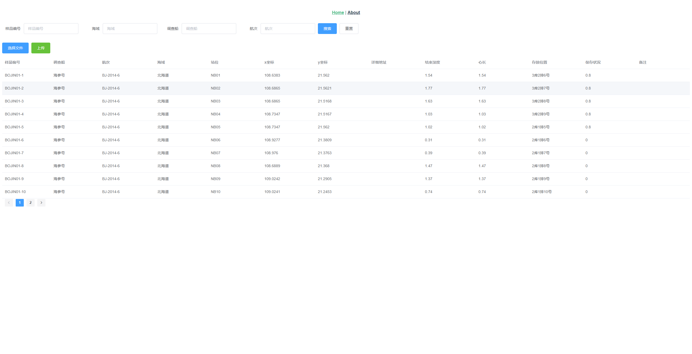

## 入库管理导入功能Demo

> 笔试题

要求：使用三范式对excel进行表结构拆分

并需实现功能：导入、查询列表信息、条件查询

本人用时：三个多小时

> 使用技术

**前端**：vue-cli进行前端框架搭建，并整合elementUI、axios

**后端**：springboot、redis、mysql、poi

最终实现：**“前后分离入库管理Demo“**

> 效果图

